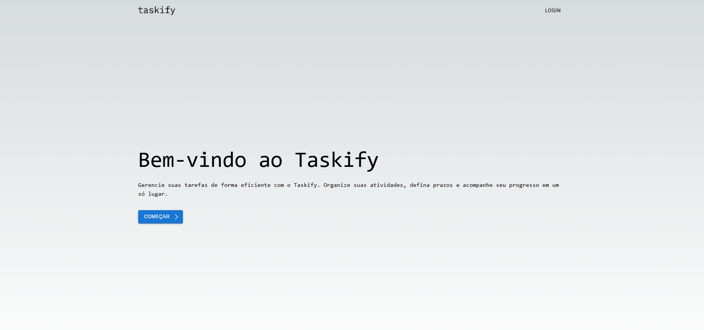
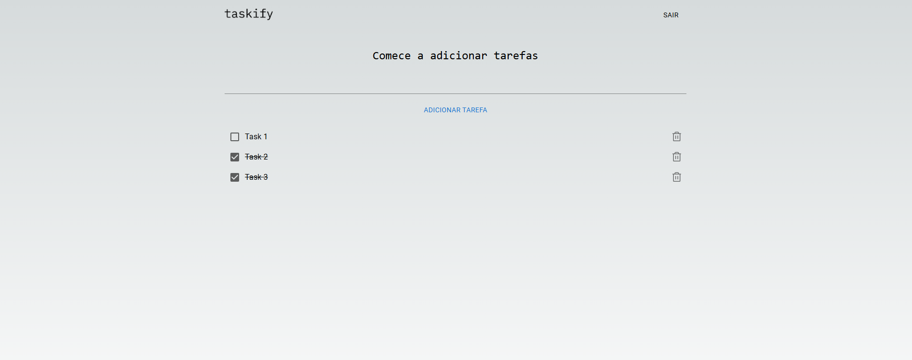

# Taskify - Gerenciador de Tarefas

Taskify é um gerenciador de tarefas desenvolvido com Next.js. O projeto está em fase de desenvolvimento e atualmente possui a interface de usuário pronta, mas o back-end ainda está em construção.

## Capturas de Tela

### Tela Inicial


### Adicionar Tarefa


## Funcionalidades

- **Adicionar Tarefas:** Permite que o usuário adicione novas tarefas à lista.
- **Listar Tarefas:** Exibe a lista de tarefas adicionadas.
- **Marcar como Concluída:** Permite que o usuário marque tarefas como concluídas.
- **Remover Tarefas:** Permite que o usuário remova tarefas da lista.

## Requisitos

- Node.js
- npm ou yarn

## Instalação

1. Clone o repositório:
    ```bash
    git clone https://github.com/sjunqueira/taskify.git
    ```
2. Navegue até o diretório do projeto:
    ```bash
    cd taskify
    ```
3. Instale as dependências:
    ```bash
    npm install
    ```
    ou
    ```bash
    yarn install
    ```

## Uso

1. Inicie o servidor de desenvolvimento:
    ```bash
    npm run dev
    ```
    ou
    ```bash
    yarn dev
    ```
2. Abra [http://localhost:3000](http://localhost:3000) no seu navegador para ver o projeto em execução.


## Contribuição

Contribuições são bem-vindas! Sinta-se à vontade para abrir issues ou enviar pull requests.

## Licença

Este projeto está licenciado sob a [MIT License](./LICENSE).

---

*Nota:* O projeto ainda está incompleto porque o back-end ainda não está pronto. Fique ligado para futuras atualizações!
